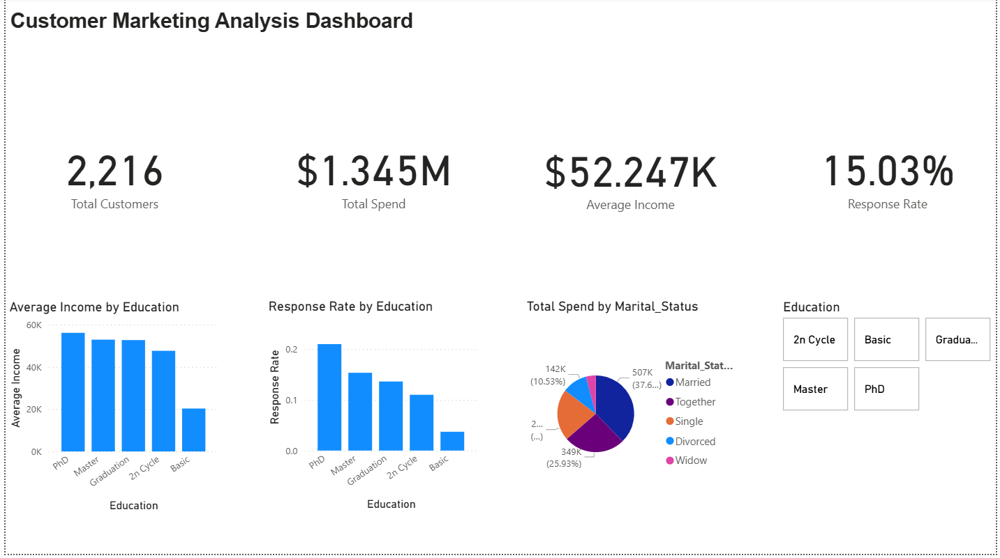

# Customer Marketing Analysis — Power BI Dashboard

## Overview
An interactive Power BI dashboard visualizing customer demographics, spending behavior, and marketing campaign response — built on the same Customer Personality Analysis dataset used in my [SQL analysis project](https://github.com/arvinpatel-ds/customer-marketing-sql-analysis). This project focuses on turning the SQL-derived insights into a visual, filterable tool a business stakeholder could actually use.

**Tools used:** Power BI Desktop, Power Query, DAX

## Dataset
2,216 customers (24 rows with missing income excluded during cleaning) — demographics, spend across 6 product categories, purchase channel usage, and marketing campaign response.

Source: Customer Personality Analysis (Kaggle)

## Dashboard Preview


*(Full interactive .pbix file available in this repo — open in Power BI Desktop to explore live filtering)*

## Key Metrics (KPI Cards)
- **Total Customers:** 2,216
- **Total Spend:** $1,345,279 across all product categories
- **Average Income:** $52,247
- **Campaign Response Rate:** 15.03%

## Visuals & What They Show
1. **Average Income by Education** — confirms income rises steadily with education level, from Basic to PhD
2. **Response Rate by Education** — PhD holders respond to campaigns at roughly 4x the rate of Basic-education customers, reinforcing this as a high-value segment to target
3. **Total Spend by Marital Status** — Married and Together customers account for the majority of spend (~63% combined)
4. **Education Slicer** — enables filtering all visuals simultaneously by education level, so a stakeholder can drill into any segment interactively

## Data Cleaning (Power Query)
- Removed rows with missing `Income` values (24 rows)
- Corrected data type mismatches (Income, Year_Birth as numeric; Dt_Customer as date)
- Fixed invalid `Marital_Status` entries ("Absurd", "YOLO") by remapping to valid categories — same data quality issue identified during the SQL phase of this project

## DAX Measures
```dax
Total Spend = SUM(MntWines) + SUM(MntFruits) + SUM(MntMeatProducts) + SUM(MntFishProducts) + SUM(MntSweetProducts) + SUM(MntGoldProds)

Total Customers = COUNTROWS(marketing_campaign)

Average Income = AVERAGE(Income)

Response Rate = DIVIDE(SUM(Response), COUNTROWS(marketing_campaign), 0)

Avg Wine Spend = AVERAGE(MntWines)
```

## Files in This Repo
- `customer_marketing_dashboard.pbix` — full interactive Power BI file
- `dashboard_screenshot.png` — static preview image
- `dashboard.pdf` — exported PDF version

## Related Project
This dashboard builds on insights first uncovered through SQL analysis in BigQuery — see the [companion SQL project](https://github.com/arvinpatel-ds/customer-marketing-sql-analysis) for the underlying queries and written insights.

## Next Steps
- Add a Python-based EDA notebook for deeper statistical analysis
- Extend to a fraud/risk-scoring project using the IEEE-CIS Fraud Detection dataset
